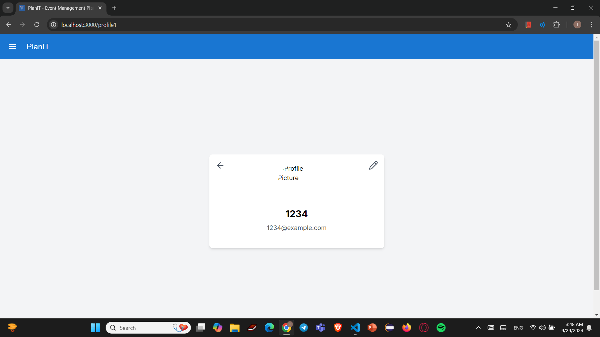

# Project02 : PlanIT Event Management System

<h2>Project Description:</h2> PlanIT is a web-based Event Management System designed to streamline the process of organizing, managing, and attending events. The platform allows organizers to create and manage events, while attendees can register for and participate in these events. The system provides a backend to handle CRUD operations for three main entities: Events, Organizers, and Attendees. It also offers a user-friendly frontend for interacting with these entities.

<h3>Team member:</h3>

LeangHour Ly: https://github.com/llh1230507/web_project

Sokty Heng:

Somavatey Heng:

<h1>Screen 1: Homepage </h1> 

The homepage welcomes users with a banner inviting them to explore various events. Event cards display details like the event name, date, and description. Access by both attendee and organizer

<h1>Screen 2: About Us </h1>

The "About Us" page introduces PlanIT's purpose, helping users discover and create events.

<h1>Screen 3: Contact</h1> 

A contact page with a form where users can submit queries.

<h1>Screen 4: Attendee Profile </h1> 

Profile page for users to update their profile picture, name, and email information.

<h1>Screen 5: View event and Purchase Ticket </h1> 

Ticket purchase page with a button to buy tickets for an event and event detail.

<h1>Screen 6: Payment page </h1> 

Payment page for entering card details like card number, expiration date, and CVV to complete a purchase.

<h1>Screen 7: Login </h1>

Login page where users sign in with their email and password.

<h1>Screen 8 : Sign Up  </h1>

Registration page allowing users to select a role (attendee or organizer) and provide personal details such as name, email, password, and profile picture.

<h1>Screen 9: Dashboard </h1> 

Admin dashboard showing metrics like the total number of events, attendees, upcoming and past events, and revenue, alongside a bar chart visualizing event and attendee data over months.

<h1>Screen 10 : Event Dashboard </h1> 

Event dashboard where all created events are listed with an option to create a new event.

<h1>Screen 11 : Event Creation </h1> 

Event creation page requiring inputs for the event name, date, start and end times, location, ticket price, and capacity. Can only be accessed by organizer.

<h1>Screen 12 : Event detail </h1> 

Event details page showing full event descriptions, ticket information, reviews, and a form to add a new review.

<h1>Screen 13 : Event Modification </h1> 

Event editing page with fields to modify the event name, date, start and end times, location, ticket price, and capacity.

<h1>Screen 14 : Organizer Info </h1> 

Same as Screen 4 —allows users to edit their profile information.

